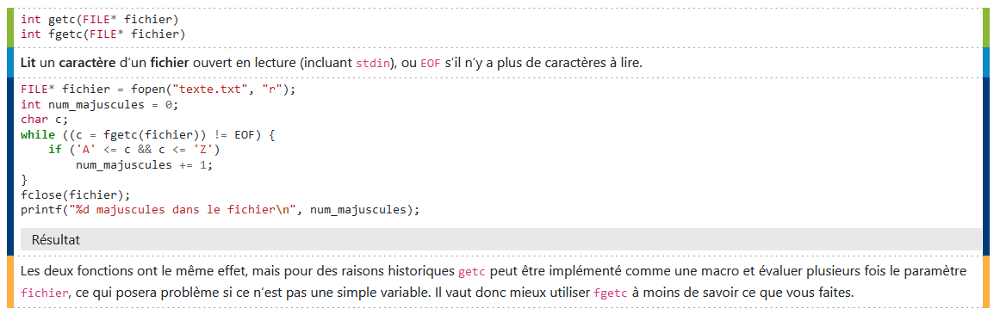

# Contribuer au PL$res
## TODO : Code de conduite

## Créer des documents

L’organisation des documents se fait dans des dossiers. Par exemple :

- info
	- c
		- reference
		- stdlib
		- ...
	- debug
		- c-cpp

Chaque dossier doit contenir un fichier `attributes.yml` :
```yaml
title: Titre de la section (obligatoire)
subtitle: Sous-titre de la section (facultatif)
relevantCourses: [IF2, LO21, LP25]  # Liste des UV auxquelles la section s’applique (facultatif)
themeColor: [R, G, B]  # Couleur RGB associée à la section, servira pour l’export PDF et les intégrations discord (facultatif)
sections:  # Sous-sections dans l’ordre à afficher, en donnant les noms des sous-dossiers et des documents (seulement s’il y a des sous-sections)
    - section1
    - section2
    - page1
    - page2
```

Dans une section de bas niveau, vous n’êtes pas obligé d’indiquer l’ordre des pages, elles seront alors dans l’ordre alphabétique.
Vous pouvez préfixer les noms de fichier par un nombre suivi de 2 tirets pour trier manuellement, le préfixe ne sera pas pris en compte dans le nom du document

- stdlib
	- 1--stddef.md
	- 2--stdbool.md
	- 3--stdlib.md
	- 4--stdio.md
	- attributes.yml

Les noms de dossiers et de fichiers doivent être idéalement simples, le titre réel est défini autrement.

Une page est un document markdown avec certaines extensions maison, qui doit contenir au moins la définition de la variable `title` qui donne le titre de la page à indiquer dans les tables des matières, et une variable `description` facultative qui donnera la description du contenu de la page pour les intégrations discord :

```markdown
//// title = "Titre de la page"
//// description = "Cette page a une description"

# {=title}
```

Le titre principal de la page peut utiliser une template avec la variable `title` si c’est le même.

### Structuration de la page

La page sera structurée à partir de l’arborescence des titres :

```
# Titre de la page (un seul dans la page)
## Section
### Sous-section
## Section 2
### Sous-section 2
#### Sous-sous-section
...
```

Par défaut, les ancres vers ces différents titres seront générés automatiquement (ex : /info/debug/c-cpp/gdb.html#section12). Si vous voulez donner l’ancre manuellement, c’est comme ceci :

```
## Titre de section //// ancre
```

### Liens internes

À chaque document est associé un identifiant unique à partir du chemin qui y mène. Par exemple, le document `info/c/stdlib/5--string.md` sera identifié par `info.c.stdlib.string` (le préfixe et l’extension ne sont pas pris en compte). Pour faire un lien vers un autre document, vous pouvez utiliser la template `{> identifiant}`, par exemple `{> info.c.stdlib.string}`

### Templating

Dans un document markdown, vous pouvez définir des variables comme ceci :

```
//// variable = valeur
```

La valeur peut être n’importe quelle expression Python. Vous pouvez ensuite intégrer le résultat d’expressions Python dans le document avec la template `{=expression}` :

```
- Valeur : {=variable}
- Valeur + 1 : {=variable + 1}
```

Si jamais vous en avez besoin en tant que chaîne de caractères HTML, sans échapper les caractères spéciaux, utilisez `{==expression}`.

### Images

Les images doivent se trouver dans le dossier `res/img`, idéalement organisées au moins en sous-dossiers par rapport à leur localisation.
Vous pouvez les intégrer de deux manières : la plus recommandée est d’utiliser des images vectorielles SVG, qui seront directement intégrées à la page avec la template suivante :

```
{!svg: info/mon-image.svg}
```

Sinon, vous pouvez intégrer tout autre type d’image comme ceci :

```
{!img: info/mon-image.png}
```

### Tableaux

Vous pouvez utiliser des tableaux de la même façon que dans du markdown Github habituel :

```
en-tête 1 | en-tête 2 | en-tête 3
--------- | --------- | ---------
contenu 1 | contenu 2 | contenu 3
contenu 4 | contenu 5 | contenu 6
```

Si besoin, vous pouvez forcer un saut de ligne dans une cellule de tableau (ou n’importe où ailleurs) avec un backslash suivi d’une espace (`\ `)

```
en-tête 1       | en-tête 2        | en-tête 3
--------------- | ---------------- | ---------
ligne 1\ ligne2 | ligne 1\ ligne 2 | contenu 3
contenu 4       | contenu 5        | contenu 6
```

### Blocs de code

Les blocs de code ressemblent à ceux du markdown classique :

````
```c
int main() {
	printf("Hello world !\n");
	return 0;
}
````

Sauf que vous pouvez y ajouter des options :

````
```langage/mode/paramètres
````

Le mode et les paramètres sont optionnels. Pour le moment il n’y a que deux modes :

- Pas de mode : ça affiche juste le code
- `result` : exécute le code à la compilation du document et donne ce qui en ressort

Vous pouvez donner des paramètres sans mode comme ceci :

````
```c//param1=valeur1; param2=valeur2
````

Les paramètres sont des couples `nom=valeur` séparés par des point-virgules. Certains paramètres sont juste des flags (qui valent True ou False), dans ce cas il suffit de donner le nom seul. Les valeurs peuvent être n’importe quelle expression Python :

````
```c/result/wrapmain; includes=["stdio.h", "stdlib.h"]
````

#### Paramètres généraux

- `linenos` (flag) : numéroter les lignes

#### Paramètres spécifiques au mode

- Mode `result`
	- `argv=["arg1", "arg2"]` : Donne la liste des arguments en ligne de commande à donner au programme
	- `stdin="entrée1\nentrée2\n"` : Donne ce qui doit être écrit sur l’entrée standard du programme pendant son exécution
	- `joinfiles=[("nom.txt", "contenu\n")]` : Donne de courts fichiers qui doivent accompagner le programme à l’exécution avec leur contenu

#### Paramètres spécifiques au mode et au langage

- Langage `c`
	- Mode `result`
		- `wrapmain` (flag) : Mettre le code dans une fonction `main()`, pour exécuter du code sans devoir encombrer le document avec du boilerplate
		- `includes=["stdlib.h", "stdio.h"]` : Donne la liste des headers standards à inclure, aussi pour exécuter du code sans encombrer la page avec les imports évidents

### Blocs de description

Pour organiser des choses que vous voulez décrire, mettre en avant ou indiquer de façon claire, vous avez les blocs de description (« fence » dans le code) :



Ils se créent comme ceci :

````
;;; code
```c
char* gets(char* chaine)```
;;; doc
**Lit** une **ligne** depuis l’**entrée standard** (ce qu’écrit l’utilisateur avant d’appuyer sur entrée), **sans inclure le saut de ligne** (qui reste donc dans le buffer).

- `chaine` : chaîne de caractères où écrire ce qu’a entré l’utilisateur

Retourne `chaine`, ou `NULL` en cas d’échec
;;; example
```c
char entree[100];
gets(entree);
```
;;; alert
`gets()` ne vérifie pas la taille du tableau, donc un utilisateur qui entrerait une ligne trop longue dépasserait de votre tableau et corromprait la mémoire de votre programme. Utilisez plutôt `fgets()` à la place.
;;;
````

Une section du bloc s’introduit par `;;; type`, et le bloc doit être terminé par `;;;`

Actuellement, les différents types de section sont les suivants :

````
;;; base
Juste quelque chose à dire
;;; code
```c/result
// Du code
int main() {
	printf("Hello World !\n");
}
```
;;; shell
```bash
# Code shell, pour la ligne de commande
```
;;; doc
Documentation, description de ce que fait le code, la fonction ou les options présentées
;;; example
```c
// Exemple d’utilisation
```
;;; note
Simple note
;;; warning
Choses auxquelles il faut faire attention
;;; alert
Avertissement, gros problèmes ou choses dangereuses si vous n’y faites pas attention
;;; counterexample
Contre-exemple. Ne faites pas ça !
;;;
````


Ces différents types sont définis dans `template/fence.yml`
